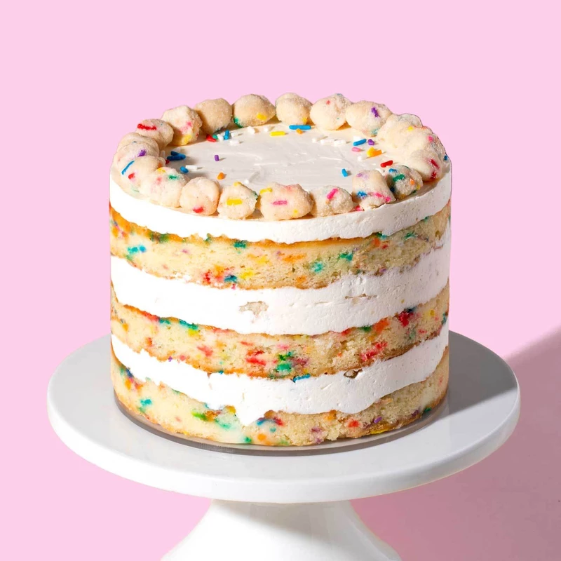

#Birthday Cakes
---

##Colorful Cake

 

####THINGS YOU'LL NEED
*Ingredients*
* 300g Odlums Self Raising Flour
* 300g Butter, at room temperature
* 300g Shamrock Caster Sugar
* 1½ tsp Odlums Baking Powder
* 6 Eggs, beaten
* 3 tbsp Milk
* Food Colouring (Blue, Yellow and Pink)
 
*Decoration*
* 375g Butter, at room temperature
* 500g Icing Sugar
* 1 tsp Goodall's Vanilla Essence (optional)
* Rainbow Jelly Beans

####LET'S GET STARTED!
1. Preheat oven to 180°C/350°F/Gas 4. Grease three 18-20cm/7-8" sandwich tins and line with parchment paper.
2. In a large bowl, beat all the cake ingredients, except for the food colourings, to form a smooth soft batter.
3. Divide the mixture evenly among three bowls. Stir a few drops of blue food colouring into one of the bowls to make a blue batter. Spread into one of the prepared baking tins.
4. Repeat with the red food colouring in the second bowl to make a pink batter, and the yellow in the third to make yellow batter. Spread each into the remaining baking tins.
5. Bake the tins for about 25-35 minutes until golden brown and the cake springs back when pressed. Turn onto a wire tray or cooling rack and allow to cool completely.
6. Start again from step 1 – this time using another 2 colours. 

####TIME TO DECORATE!
1. Spread the remaining buttercream over the top and sides of the cake.
2. Decorate the outside with the jelly beans until completely covered.
