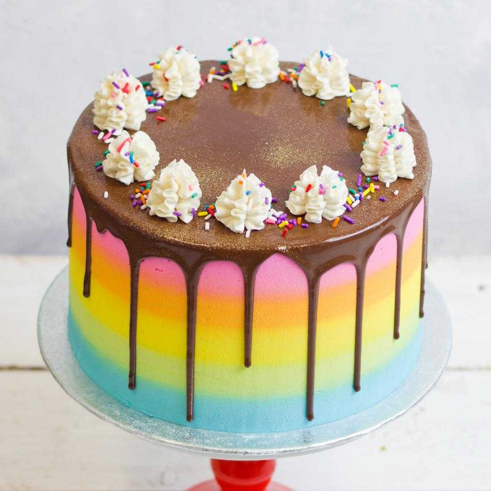

##Birthday Cakes
---

##Rainbow Cake

 

####THINGS YOU'LL NEED
*Ingredients*
* 1/3 cup all-purpose flour
* 1/2 tablespoon cornstarch
* 1/4 teaspoon baking powder
* 3/4 teaspoon baking soda
* 1/8 teaspoon salt
* 5 tablespoons butter, softened
* 3/4 cup sugar
* 2/3 cup mashed banana
* 1/3 cup buttermilk
* 2 eggs

*Decoration*
* 1/2 cup whipping cream
* 2/3 cup chocolate chips
* Sprinkles
* Whipped cream
* 12 Maraschino cherries

####LET'S GET STARTED!
1. Preheat oven to 350 degrees F. Line a muffin tin with 12 cupcakes liners.
2. In a large mixing bowl, combine flour, cornstarch, baking powder, baking soda, and salt. Set aside.
3. Use can electric mixer to beat butter and sugar together until light and fluffy. Mix in the the banana, buttermilk, and eggs until combined. Add in the dry ingredients a little at a time while mixing, until combined. Divide batter among the liners (an ice cream scoop works perfect for this!) and bake for 15-18 minutes or until toothpick comes out clean.
4. Remove cupcakes from tin and allow to cool on a rack.

####TIME TO DECORATE!
1. Place chocolate chips in a bowl and set aside. Place whipping cream in another dish and microwave until hot (about 45 seconds).
2. Pour hot whipping cream over the chocolate chips and let it sit for 2 minutes and then stir together until completely melted and combined. 
3. Allow the ganache for cool down for a few minutes before spooning on too of the frosting.
4. Add sprinkles on top of the ganache. 
5. Pipe a little whipped cream on and then top with a cherry
6. Serve!