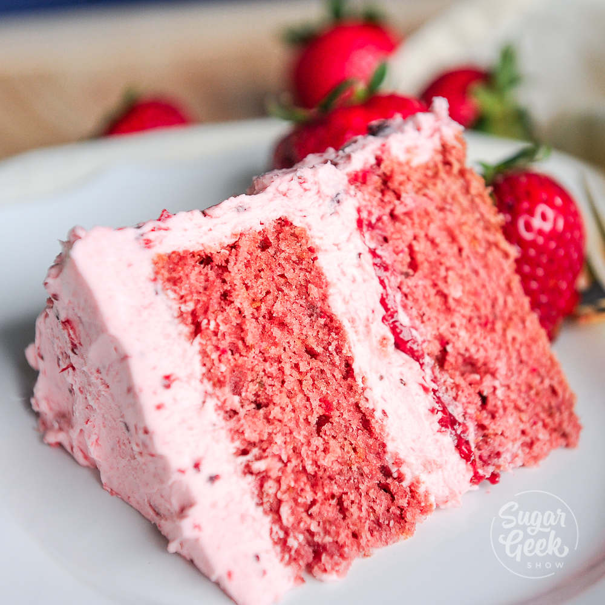

## Cakes
---

## Strawberry Cake

 

####THINGS YOU'LL NEED
*Ingredients*
* 2 cups all purpose flour
* 2 teaspoons baking powder
* ⅛ teaspoon salt
* 1 stick (4 ounces) salted butter, at room temperature
* ¼ cup solid vegetable shortening
* 1 ½ cups sugar
* 2 teaspoons vanilla extract
* ¼ teaspoons almond extract
* 5 large egg whites
* ¾ cup whole milk
* ¼ cup rainbow sprinkles

*Decoration*
* White buttercream frosting
* Light pink, light purple, dark purple buttercream frosting
* White fondant
* Edible gold dust
* Small paint brushes
* Fondant rolling pin
* Teardrop cookie cutters
* Lollipop stick

####LET'S GET STARTED!
1. Preheat oven to 350ºF. Grease and line three six-inch round cake pans.
2. In a medium bowl, whisk together flour, baking powder, and salt.
3. In a large bowl, use an electric mixer to beat butter, shortening and sugar until light and fluffy.
4. Add egg whites one at a time, beating well after each addition. Beat in vanilla and almond extracts.
5. On low speed, alternate adding the flour mixture and milk to the butter mixture, beginning and ending with the flour. Fold sprinkles into the batter.
6. Divide batter evenly between cake pans bake for 30 to 35 minutes.
Once cakes are fully cooled, level them with a cake leveler.
7. Stack cakes on a cake board, making sure to frost between each layer.
8. Use a cake turntable to smooth white frosting over the entire cake.

####TIME TO DECORATE!
1. Use white fondant to make a unicorn horn.
2. Mix a few drops of almond extract into edible gold dust and then brush it onto the horn.
3. Use teardrop cutters to create fondant ears and then paint the inner ear gold. Insert a toothpick into the bottom of each ear.
4. Pipe rosettes on the top and along one side of the cake using the pink and light purple frostings each fitted with a #824 tip.
5. dd dollops of details using the pink and dark purple frostings each fitted with a #4B tip and the blue and dark purple frosting each fitted with a #2A tip.
6. Pipe eyes onto the front center of the cake. Place horn on the top center of the cake and the ears on either side of the horn.
7. Ta-da! This colorful Unicorn Cake will bring magic to any occasion!

