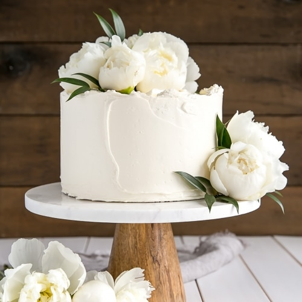

#Wedding Cakes
---

##Lemon Cake

 

####THINGS YOU'LL NEED
*Ingredients*
* 3 cups all-purpose flour
* 1 Tbsp baking powder
* 3/4 tsp salt
* 1 cup unsalted butter room temperature
* 1 Tbsp lemon zest from one large lemon
* 2 cups granulated sugar
* 4 large eggs room temperature
* 2 tsp vanilla
* 2/3 cup milk room temperature
* 1/3 cup lemon juice fresh squeezed, from one medium lemon
 
*Decoration*
* 6 large egg whites
* 2 cups granulated sugar
* 3 cups unsalted butter room temperature
* 2-4 Tbsp elderflower cordial to taste

####LET'S GET STARTED!
1. Preheat oven to 350F. Grease and flour three 8" cake rounds and line with parchment.
2.In a medium bowl, whisk flour, baking powder, and salt until well combined. Set aside.
3. Using a stand mixer fitted with a paddle attachment, cream butter and lemon zest until smooth. Add sugar and beat on med-high until pale and fluffy (approx 3mins).
4. Reduce speed and add eggs one at a time fully incorporating after each addition. Add vanilla.
5. Alternate adding flour mixture with milk & lemon juice, beginning and ending with flour (3 additions of flour and 2 of milk & lemon juice). Fully incorporating after each addition.
6. Place cakes on wire rack to cool for 10mins then turn out onto wire rack to cool completely

####TIME TO DECORATE!
1. Place one layer of cake on a cake stand or serving plate. Poke holes into the cake using a bamboo skewer. Brush with elderflower cordial.***
2. Spread a thin layer of buttercream on top of the layer and pipe a border around the outside to hold the lemon curd in. Fill with approx 3/4 cup of lemon curd. Repeat with next layer.
3. Place final layer on top and do a thin crumb coat on the cake. Chill for 20mins.
4. Top with fresh peonies if desired, but be sure to wrap the stems in floral tape. 
